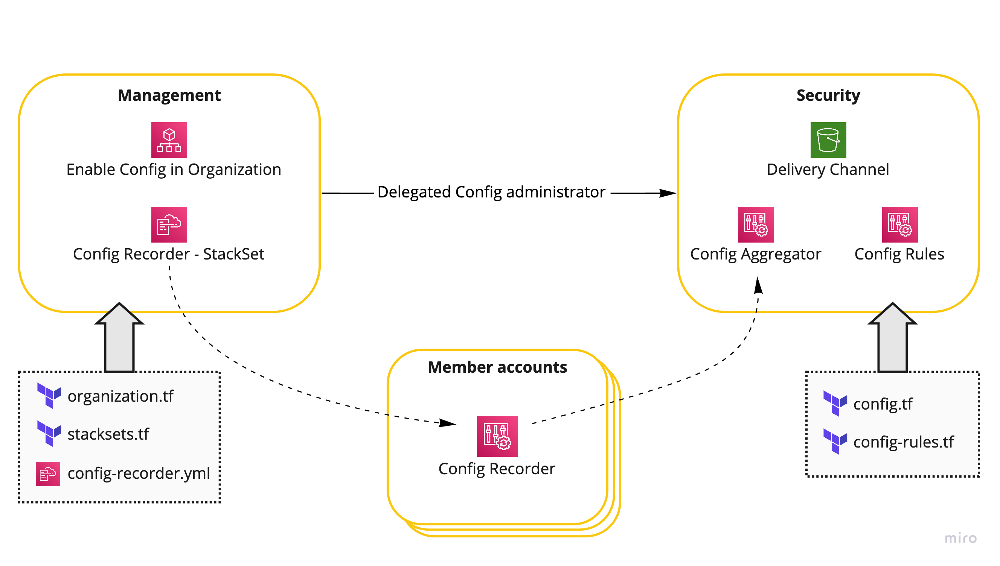

# aws-organization-config
Foundation for AWS Config deployment in an AWS Organization using Terraform.

 - Utilize [CloudFormation StackSets][1] to reliable enable [Config Recorder][2] in all or selected OUs. Created in Management account but could be extended to utilize separate delegated administration account.
 - Delegate Config administration from management account to separate security account.
 - Security account has some sample [Config Managed Rules][3] enabled to track compliance for all accounts.

[1]: https://docs.aws.amazon.com/AWSCloudFormation/latest/UserGuide/what-is-cfnstacksets.html
[2]: https://docs.aws.amazon.com/config/latest/developerguide/stop-start-recorder.html
[3]: https://docs.aws.amazon.com/config/latest/developerguide/evaluate-config_use-managed-rules.html
